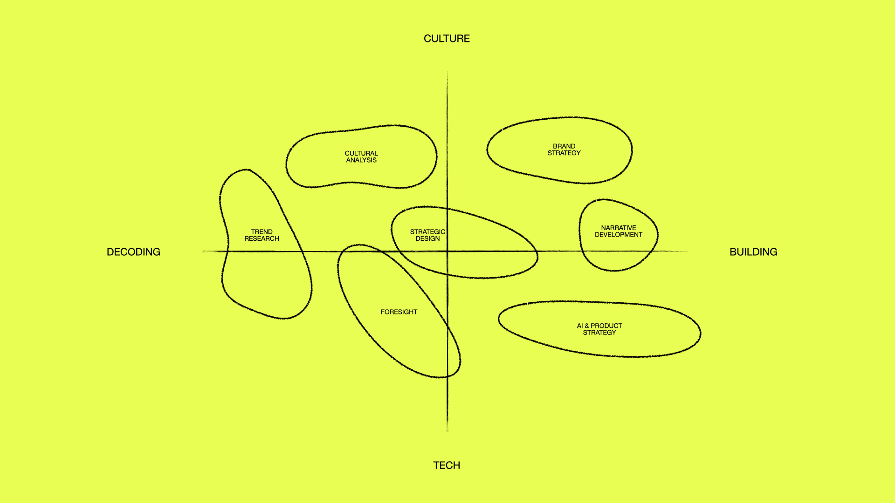

# Brain Dead Reference Architecture

> Making strategy executable, transparent, and creative through explicit protocols and AI collaboration

## About This Project

This system was built by a non-coder.

I'm [Igor Schwarzmann](https://igorschwarzmann.com)—a cultural researcher and brand strategist who has spent 20 years working at the intersection of culture and technology:

*My work sits at the intersection of decoding/building and culture/tech*

I've operated in this space my entire career, but I never learned to code. What changed was discovering that **you cannot delegate what you cannot articulate**. When I started building AI-augmented workflows for my strategy practice, I had to make my implicit methodology explicit. This repository is the result of that journey—a documented system for making strategic thinking executable, built through doing rather than coding.

### Why "Brain Dead"?

The name is a deliberate joke on knowledge management's obsession with being "serious." While everyone else talks about their "second brain," I named my vault after [Brain Dead](https://wearebraindead.com)—the LA streetwear collective that puts a lowbrow, irreverent name on high-concept art and cultural work. It's a reminder that making your thinking explicit doesn't require pretentiousness. Sometimes the best systems have dumb names.

## What is this?

A documented reference architecture showing how markdown-based knowledge systems + Claude Code create executable, transparent strategy. Not a product to install - a pattern to adapt.

## Important: Patterns, Not Implementation

**This repository shows architecture, not working code.** Think Christopher Alexander's "A Pattern Language" - patterns you adapt, not blueprints you copy-paste.

**What we provide:**

- ✅ Architectural patterns and concepts
- ✅ Decision frameworks and trade-offs
- ✅ Documentation explaining the thinking
- ✅ Guidance for building your own

**What we DON'T provide:**

- ❌ Copy-paste code that "just works"
- ❌ Step-by-step installation instructions
- ❌ Implementation support or debugging help
- ❌ One-size-fits-all solutions

**How to implement:** Use Claude Code to build YOUR version based on these patterns. Your vault structure, metadata schema, and infrastructure will be unique to your needs. See the documentation for example prompts showing how to ask Claude Code for implementation help.

## The Four Layers

1. **Structure (PARA + Frontmatter)**: Organization that creates semantic context
2. **Protocol (CLAUDE.md + Workflows)**: Explicit decision rules and preferences
3. **Infrastructure (RAG + Skills)**: Semantic search and automation
4. **Executable Strategy**: AI can actually use your knowledge

## Quick Start

**Level 1: Start documenting** (no tools required)
- Pick one process you do repeatedly
- Write it down in plain markdown
- [Guide](docs/01-getting-started.md)

**Level 2: Add structure** (works with any markdown tool)
- Adopt PARA organization
- Add YAML frontmatter for context
- [Guide](docs/02-para-organization.md)

**Level 3: Make it executable** (requires Claude Code)
- Create your CLAUDE.md operating manual
- Build custom skills for workflows
- [Guide](docs/04-claude-configuration.md)

**Level 4: Add intelligence** (optional advanced)
- Set up RAG for semantic search
- Build collection-specific queries
- [Guide](docs/06-rag-infrastructure.md)

## Who is this for?

- **Strategic consultants** managing complex client engagements
- **Researchers** with long-term projects and extensive notes
- **Knowledge workers** wanting systematic AI-augmented workflows
- **Anyone** who read Strategy-as-Protocol and thought "but how?"

## What you'll find here

- **[/docs/](docs/)**: Comprehensive guides explaining the architecture and thinking

## Philosophy

AI forces transparency. You can't delegate what you can't articulate.

When you write your decision rules explicitly - in plain markdown - they become:
- **Readable** by people (your team can engage with them)
- **Executable** by machines (AI can follow them)
- **Debuggable** (you can trace decisions back to rules)
- **Improvable** (you can evolve the protocol)

This isn't about making AI work like you. It's about making your work more explicit, which benefits both humans and AI.

## What this is NOT

- ❌ A product to install
- ❌ A rigid system to replicate exactly
- ❌ A replacement for thinking
- ❌ A magic solution to organizational problems

## What this IS

- ✅ A reference architecture to learn from
- ✅ A pattern to adapt to your domain
- ✅ A starting point for explicit protocols
- ✅ A way to make implicit expertise visible

## Getting Started

1. Read [Philosophy](docs/00-philosophy.md) to understand the "why"
2. Follow [Getting Started Guide](docs/01-getting-started.md) to pick your entry point
3. Use the documentation to understand the patterns
4. Build your own version based on your needs - don't replicate

## Contributing

This is a reference architecture from one person's practice. It's published to help others build their own systems, not as a community project.

If you build something cool with these patterns, I'd love to hear about it - but please don't expect support or maintenance.

## License

MIT License - adapt freely, credit appreciated.

## Questions?

Read the [FAQs](docs/08-faqs.md) or open an issue for clarification.

## About

Created by Igor Schwarzmann - strategic consultant specializing in AI strategy and cultural research.

This architecture powers 15+ years of client work. Read the full thinking behind this approach in [Strategy-as-Protocol](https://thenew.igorschwarzmann.com/p/strategy-as-protocol).
